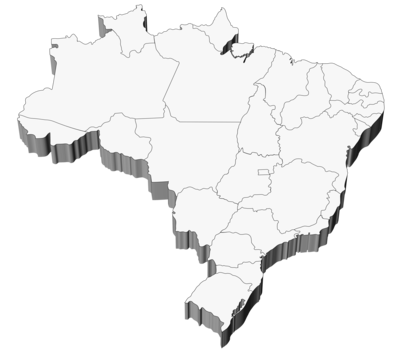

# Estados do Brasil

Este projeto web permite explorar informações detalhadas sobre os estados do Brasil, como capital, população, área territorial, densidade demográfica, entre outros dados. Os usuários podem realizar buscas por nome do estado, capital ou região, utilizando um campo de pesquisa dinâmico.

## Funcionalidades

- Pesquisa por nome do estado, capital ou região.
- Exibição de dados detalhados sobre os estados, como:
  - Capital
  - Área Territorial
  - População
  - Densidade Demográfica
  - Região
  - Índice de Desenvolvimento Humano (IDH)
  - Mapa do estado
- Suporte a buscas com ou sem acentuação.
- Exibição de resultados em tempo real.

## Estrutura do Projeto

O projeto é composto pelos seguintes arquivos principais:

### `index.html`

Este arquivo contém a estrutura básica da página, incluindo o campo de busca e a área onde os resultados são exibidos.

```html
<!DOCTYPE html>
<html lang="pt-BR">
<head>
    <meta charset="UTF-8">
    <meta name="viewport" content="width=device-width, initial-scale=1.0">
    <link rel="stylesheet" href="style.css">
    <title>Estado do Brasil</title>
</head>
<body>
    <header>
        <h1>Explorando os Estados do Brasil</h1>
        <h2>Descubra informações detalhadas e curiosidades sobre cada região do país</h2>
    </header>
    <main>
        <section>
            
            <input type="text" id="campo-busca" placeholder="Digite o nome do estado, a capital, a região..." autofocus>
            <button onclick="buscar()" class="button-busca">Buscar</button>
        </section>
        <section class="resultados-pesquisa" id="resultados-pesquisa"></section>
    </main>
    <footer>
        <p>2024 - estados brasileiros</p>
    </footer>
    <script src="dados-dos-estados.js"></script>
    <script src="app.js"></script>
</body>
</html>
